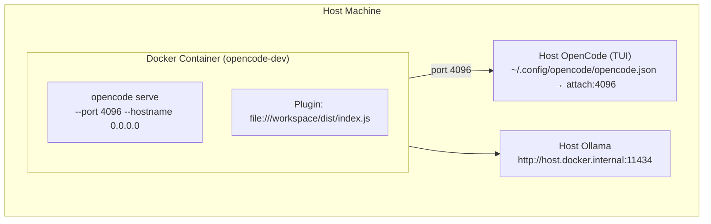

# Docker Dev Environment for lancedb-opencode-pro Plugin

Run OpenCode in a Docker container with the plugin loaded for isolated testing.

## Architecture



## Setup

### 1. Build and start

```bash
docker compose build --no-cache && docker compose up -d
```

### 2. Build the plugin (first time or after code changes)

```bash
docker compose exec opencode-dev npm run build
```

### 3. Configure Host OpenCode to attach

Create `~/.config/opencode/opencode.json` on your host:

```json
{
  "$schema": "https://opencode.ai/config.json",
  "agent": {
    "attach": "http://localhost:4096"
  }
}
```

### 4. Start Host OpenCode

```bash
opencode
```

## Workflow

### Making changes

1. Edit code on host
2. Rebuild: `docker compose exec opencode-dev npm run build`
3. Reload: `docker compose restart opencode-dev`

### Running tests

```bash
docker compose exec opencode-dev npm run verify
docker compose exec opencode-dev npm run test:foundation
```

## Verification

```bash
# Check plugin config is loaded
curl -s -u opencode:devonly http://localhost:4096/config | \
  python3 -c "import sys,json; c=json.load(sys.stdin); print('plugin:', c.get('plugin',[]))"

# Check tools are registered
curl -s -u opencode:devonly http://localhost:4096/experimental/tool/ids | \
  python3 -c "import sys,json; t=json.load(sys.stdin); print([x for x in t if 'memory' in x])"
```

Expected tool list includes: `memory_search`, `memory_consolidate`, `memory_stats`, etc.

## Cleanup

```bash
docker compose down        # stop
docker compose down -v    # stop + remove volumes
```
