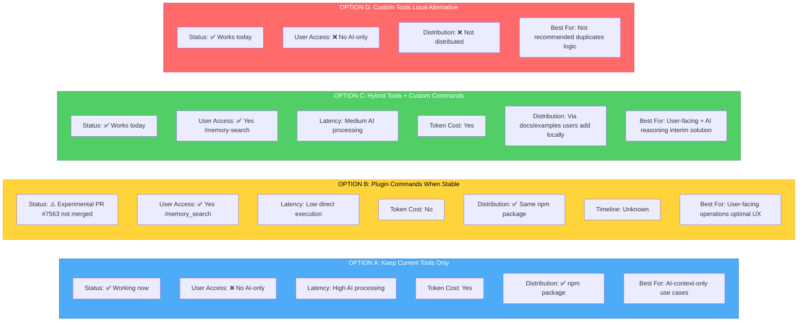
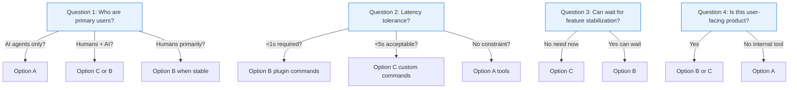

================================================================================
OPENCODE EXTENSIBILITY ANALYSIS - FINDINGS SUMMARY
================================================================================

PROJECT: lancedb-opencode-pro v0.1.0
DATE: March 16, 2026
SCOPE: Evaluate options for memory search/delete/clear UX

================================================================================
KEY FINDINGS
================================================================================

1. CURRENT IMPLEMENTATION ✅
   - 4 plugin tools: memory_search, memory_delete, memory_clear, memory_stats
   - Distributed via npm package (@opencode-ai/plugin@1.2.25)
   - AI-only invocation (no direct user access)
   - Source: src/index.ts (325 lines)

2. OPENCODE EXTENSIBILITY ARCHITECTURE
   Three-tier system exists:
   
   TIER 1: PLUGINS (Heavy)
   - Hook into events, register tools, modify behavior
   - Distribution: npm packages or local files
   - Evidence: https://opencode.ai/docs/plugins/ (Mar 15, 2026)
   
   TIER 2: CUSTOM TOOLS (Medium)
   - Functions LLM can call
   - AI-only invocation
   - Evidence: https://opencode.ai/docs/custom-tools/ (Mar 15, 2026)
   
   TIER 3: CUSTOM COMMANDS (Light)
   - Slash commands (/command) in TUI
   - Direct user invocation
   - Evidence: https://opencode.ai/docs/commands/ (Mar 15, 2026)

3. PLUGIN COMMANDS (EXPERIMENTAL) ⚠️
   Status: NOT YET STABLE
   - PR #7563: "feat(opencode) plugin commands" - OPEN
   - Created: Jan 10, 2026
   - Last activity: Jan 30, 2026
   - No merge date announced
   - Feature behind experimental.pluginCommands flag
   - Evidence: https://github.com/anomalyco/opencode/pull/7563
   
   What it enables:
   - Plugin tools can optionally appear as slash commands
   - Direct execution (no AI processing)
   - Backwards compatible (command defaults to false)
   - Expected API: tool({ command: true, ... })

4. NPM DISTRIBUTION CAPABILITIES
   ✅ Can distribute: Plugins, custom tools, hooks
   ❌ Cannot distribute: Custom commands (local only)
   
   Current project: Distributed as npm plugin
   Installation: npm install -g lancedb-opencode-pro
   Loading: Via opencode.json config

================================================================================
PRACTICAL OPTIONS FOR MEMORY UX
================================================================================

================================================================================
DECISION FRAMEWORK
================================================================================

================================================================================
RECOMMENDATION
================================================================================

IMMEDIATE (Now):
- Keep plugin tools as-is (Option A)
- Document memory tools in README
- Provide example custom commands in docs

SHORT-TERM (1-2 months):
- Monitor PR #7563 for merge status
- If user-facing UX needed: Implement Option C (custom commands)
- Test with early adopters

MEDIUM-TERM (When PR #7563 merges):
- If API stable: Add `command: true` to tools
- Update documentation
- Release v0.2.0 with plugin command support

LONG-TERM:
- Gather user feedback
- Optimize based on usage patterns
- Consider direct memory API (non-tool)

================================================================================
UNCERTAINTY & CAVEATS
================================================================================

KNOWN UNKNOWNS:
1. Plugin Commands API Stability
   - PR #7563 still open (not merged)
   - Exact API may change
   - No announced merge date
   → Recommendation: Monitor PR before committing

2. OpenCode Release Timeline
   - Feature is experimental
   - No ETA for stable release
   → Recommendation: Don't block on this

3. User Demand
   - No data on whether users want direct memory commands
   - May be satisfied with AI-only tools
   → Recommendation: Gather feedback before investing

4. Performance Characteristics
   - Plugin commands latency unknown
   - No benchmarks available
   → Recommendation: Test once available

CONFIDENCE LEVELS:
- OpenCode plugin system stable: HIGH
- npm distribution mechanism: HIGH
- Custom commands work as documented: HIGH
- Plugin commands will stabilize: MEDIUM

================================================================================
EVIDENCE & SOURCES
================================================================================

OFFICIAL DOCUMENTATION (Last updated Mar 15, 2026):
✓ https://opencode.ai/docs/plugins/
✓ https://opencode.ai/docs/custom-tools/
✓ https://opencode.ai/docs/commands/

GITHUB REFERENCES:
✓ PR #7563: https://github.com/anomalyco/opencode/pull/7563
✓ Issue #10262: https://github.com/anomalyco/opencode/issues/10262
✓ Project: https://github.com/ichiayi-238/lancedb-opencode-pro

PROJECT CODE:
✓ src/index.ts (325 lines) - Plugin implementation
✓ package.json - Dependencies and distribution config
✓ README.md - Installation and configuration

================================================================================
DELIVERABLES
================================================================================

1. docs/EXTENSIBILITY_ANALYSIS.md (20KB)
   - Comprehensive 9-part analysis
   - Evidence-based findings
   - Detailed options matrix
   - Implementation roadmap

2. docs/QUICK_REFERENCE.md (2KB)
   - Quick decision guide
   - Key references
   - Implementation roadmap
   - Uncertainty summary

3. This summary document
   - Executive findings
   - Decision framework
   - Recommendations
   - Evidence sources

================================================================================
NEXT STEPS
================================================================================

1. Review this analysis with stakeholders
2. Answer the 4 decision framework questions
3. Choose Option A, B, or C based on answers
4. If Option C: Create .opencode/commands/ examples
5. If Option B: Monitor PR #7563 for merge status
6. Gather user feedback on memory UX needs

================================================================================
