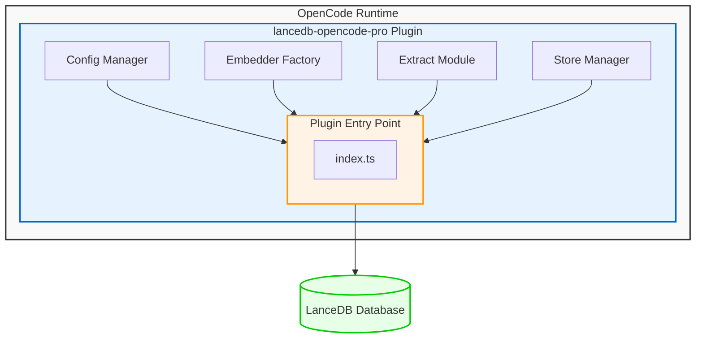
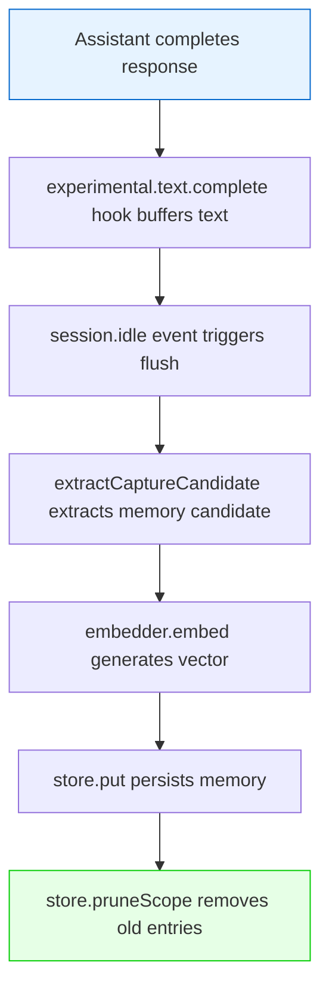
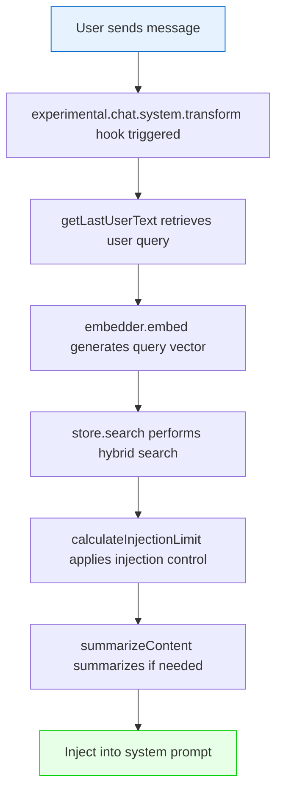
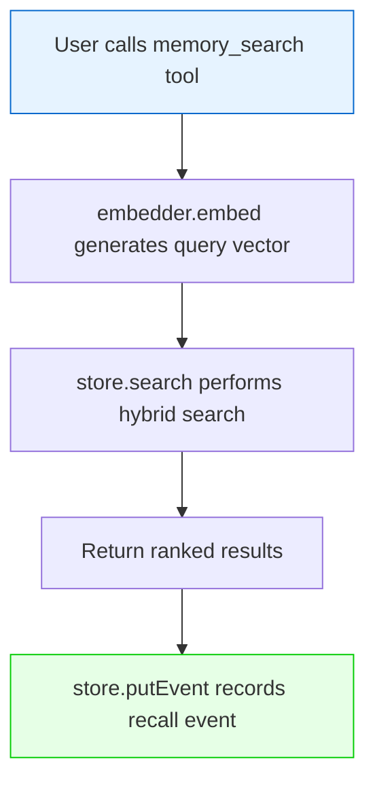

# System Architecture

**Status**: Production Ready  
**Last Updated**: March 2026  
**Audience**: Developers, architects, and operators

---

## Overview

lancedb-opencode-pro is a long-term memory provider for OpenCode, enabling persistent memory across sessions. It uses LanceDB as its primary storage engine with no immediate migration plans; the storage boundary between plugin logic and persistence is clearly defined (see Storage Engine Boundary).

### Key Features

- **Persistent Memory**: Memories survive across OpenCode sessions
- **Hybrid Search**: Combines vector similarity and BM25 lexical search
- **Scope Isolation**: Project-scoped memories with optional global sharing
- **Auto-Capture**: Automatically extracts durable outcomes from assistant responses
- **Injection Control**: Configurable memory injection with summarization

---

## System Architecture

### Component Overview



### Component Details

#### 1. Plugin Entry Point (`index.ts`)

**Responsibility**: Main plugin interface with OpenCode runtime

**Key Functions**:
- `createRuntimeState()`: Initialize plugin state
- `flushAutoCapture()`: Persist buffered assistant responses
- `experimental.chat.system.transform`: Inject memories into system prompt
- `experimental.text.complete`: Buffer assistant responses for capture

**Hooks**:
- `config`: Handle configuration changes
- `event`: Process session events (idle, compacted)
- `experimental.text.complete`: Capture assistant responses
- `experimental.chat.system.transform`: Inject memories

#### 2. Configuration Manager (`config.ts`)

**Responsibility**: Load and validate configuration from multiple sources

**Configuration Sources** (priority order):
1. Environment variables (`LANCEDB_OPENCODE_PRO_*`)
2. Project config (`.opencode/lancedb-opencode-pro.json`)
3. Global config (`~/.config/opencode/lancedb-opencode-pro.json`)
4. Built-in defaults

**Key Exports**:
- `resolveMemoryConfig()`: Merge configuration from all sources
- `MemoryRuntimeConfig`: Configuration interface

#### 3. Embedder Factory (`embedder.ts`)

**Responsibility**: Create embedding providers

**Supported Providers**:
- `OllamaEmbedder`: Local Ollama server
- `OpenAIEmbedder`: OpenAI API

**Key Features**:
- Automatic dimension detection
- Fallback dimension lookup
- Timeout handling

**Key Exports**:
- `createEmbedder()`: Factory function
- `Embedder` interface: `embed()`, `dim()`

#### 4. Extract Module (`extract.ts`)

**Responsibility**: Extract durable memories from assistant responses

**Extraction Logic**:
- Pattern matching for decisions, preferences, facts
- Category assignment (decision, preference, fact, entity, other)
- Importance scoring

**Key Exports**:
- `extractCaptureCandidate()`: Extract memory candidate
- `isGlobalCandidate()`: Check if memory should be global

#### 5. Store Manager (`store.ts`)

**Responsibility**: LanceDB database operations

**Key Features**:
- CRUD operations for memories
- Hybrid search (vector + BM25)
- Scope filtering
- Index management
- Effectiveness event tracking

**Key Exports**:
- `MemoryStore` class: Main storage interface
- `search()`, `put()`, `deleteById()`, `clearScope()`

#### 6. Summarization Module (`summarize.ts`)

**Responsibility**: Summarize memories before injection

**Summarization Modes**:
- `none`: No summarization
- `truncate`: Simple character truncation
- `extract`: Key sentence extraction
- `auto`: Content-aware summarization

**Key Exports**:
- `summarizeContent()`: Summarize text
- `calculateInjectionLimit()`: Calculate injection budget

---

## Storage Engine Boundary

### Overview

LanceDB is the designated primary storage engine for this project. No migration to an alternative vector database is currently planned. The roadmap reflects this commitment, with future work focused on optimization within LanceDB rather than replacement.

### Storage Contract

The storage engine provides these persistence primitives:

- **Embedded persistence**: Local file-based database with no external server dependency
- **Table/schema ownership**: Full control over table structures (`memories`, `effectiveness_events`)
- **Vector and text indexes**: Native support for IVF-PQ vector indexes and BM25 full-text search
- **Filtering predicates**: Efficient scalar filtering via LanceDB's query DSL
- **Schema evolution**: Support for additive column migrations

### Responsibility Split

| Layer | Owner | Responsibilities |
|-------|-------|-------------------|
| Plugin JavaScript | `lancedb-opencode-pro` | Extraction logic, capture orchestration, hybrid retrieval composition, rerank/scope logic, injection decisions, event governance, effectiveness tracking |
| LanceDB | LanceDB library | Persistence primitives, vector index optimization, FTS index management, query execution, disk I/O |

### Boundary-Aligned Future Work

The following backlog items respect this storage boundary:

- **BL-036**: Large-scope ANN fast-path optimization (query-side, no engine switch)
- **BL-037**: Effectiveness events TTL/archival (retention policy, compliant with LanceDB capabilities)

### Re-evaluation Triggers

Storage engine re-evaluation would be triggered only by:
1. Fundamental performance issues that cannot be resolved within LanceDB
2. Significant changes in LanceDB's maintenance status or roadmap direction
3. New requirements that fundamentally conflict with LanceDB's architecture

These triggers are documented in `docs/roadmap.md` and represent exceptional cases, not planned work.

---

## Data Model

### Memory Record

```typescript
interface MemoryRecord {
  // Identity
  id: string;                    // UUID
  text: string;                  // Memory content
  
  // Vector
  vector: number[];              // Embedding vector
  vectorDim: number;             // Vector dimension
  embeddingModel: string;        // Model name
  
  // Metadata
  category: MemoryCategory;      // decision|preference|fact|entity|other
  scope: string;                 // project:* or global
  importance: number;            // 0-1 importance score
  
  // Timestamps
  timestamp: number;             // Creation time (epoch ms)
  lastRecalled: number;          // Last recall time (epoch ms)
  
  // Usage
  recallCount: number;           // Number of recalls
  projectCount: number;          // Projects that recalled this
  
  // Schema
  schemaVersion: number;         // Schema version (currently 1)
  metadataJson: string;          // Additional metadata (JSON)
}
```

### Effectiveness Event

```typescript
interface MemoryEffectivenessEvent {
  // Identity
  id: string;                    // UUID
  type: "capture" | "recall" | "feedback";
  scope: string;                 // project:* or global
  sessionID?: string;            // Session ID
  
  // Timestamp
  timestamp: number;             // Event time (epoch ms)
  
  // Capture-specific
  outcome?: "considered" | "stored" | "skipped";
  skipReason?: CaptureSkipReason;
  memoryId?: string;             // Associated memory ID
  
  // Recall-specific
  resultCount?: number;          // Number of results
  injected?: boolean;            // Was injected into prompt
  source?: "system-transform" | "manual-search";
  
  // Feedback-specific
  feedbackType?: "missing" | "wrong" | "useful";
  helpful?: boolean;             // Was memory helpful
  reason?: string;               // Feedback reason
  labels?: string[];             // Feedback labels
  
  // Common
  text?: string;                 // Associated text
  metadataJson: string;          // Additional metadata (JSON)
}
```

### Configuration Model

```typescript
interface MemoryRuntimeConfig {
  // Database
  dbPath: string;                // Database path
  
  // Embedding
  embedding: {
    provider: "ollama" | "openai";
    model: string;
    baseUrl?: string;
    apiKey?: string;             // OpenAI only
    timeoutMs?: number;
  };
  
  // Retrieval
  retrieval: {
    mode: "hybrid" | "vector";
    vectorWeight: number;        // 0-1
    bm25Weight: number;          // 0-1
    minScore: number;            // Minimum score threshold
    rrfK: number;                // Reciprocal Rank Fusion parameter
    recencyBoost: boolean;
    recencyHalfLifeHours: number;
    importanceWeight: number;
  };
  
  // Injection
  injection: {
    mode: "fixed" | "budget" | "adaptive";
    maxMemories: number;
    minMemories: number;
    budgetTokens: number;
    maxCharsPerMemory: number;
    summarization: "none" | "truncate" | "extract" | "auto";
    summaryTargetChars: number;
    scoreDropTolerance: number;
    injectionFloor: number;
    codeSummarization: {
      mode: "smart" | "truncate" | "preserve";
      preserveStructure: boolean;
    };
  };
  
  // Scope
  includeGlobalScope: boolean;
  globalDetectionThreshold: number;
  globalDiscountFactor: number;
  
  // Retention
  maxEntriesPerScope: number;
  unusedDaysThreshold: number;
  minCaptureChars: number;
}
```

---

## Data Flow

### Auto-Capture Flow



### Recall Flow



### Manual Search Flow



---

## Database Schema

### LanceDB Tables

#### memories

| Column | Type | Description |
|--------|------|-------------|
| id | string | UUID primary key |
| text | string | Memory content |
| vector | float[] | Embedding vector |
| vectorDim | int | Vector dimension |
| embeddingModel | string | Model name |
| category | string | Memory category |
| scope | string | Project or global scope |
| importance | float | Importance score (0-1) |
| timestamp | bigint | Creation time (epoch ms) |
| lastRecalled | bigint | Last recall time (epoch ms) |
| recallCount | int | Number of recalls |
| projectCount | int | Projects recalled from |
| schemaVersion | int | Schema version |
| metadataJson | string | Additional metadata (JSON) |

**Indexes**:
- `vector`: Vector index for similarity search
- `text`: FTS index for BM25 search

#### effectiveness_events

| Column | Type | Description |
|--------|------|-------------|
| id | string | UUID primary key |
| type | string | Event type |
| scope | string | Project or global scope |
| sessionID | string | Session ID |
| timestamp | bigint | Event time (epoch ms) |
| memoryId | string | Associated memory ID |
| text | string | Associated text |
| outcome | string | Capture outcome |
| skipReason | string | Skip reason |
| resultCount | int | Recall result count |
| injected | boolean | Was injected |
| source | string | Recall source |
| feedbackType | string | Feedback type |
| helpful | boolean | Was helpful |
| reason | string | Feedback reason |
| labelsJson | string | Feedback labels (JSON) |
| metadataJson | string | Additional metadata (JSON) |

---

## Key Algorithms

### Hybrid Search

1. **Vector Search**: Compute cosine similarity between query vector and all record vectors
2. **BM25 Search**: Compute BM25-like score using tokenized query and document
3. **Rank Fusion**: Combine scores using Reciprocal Rank Fusion (RRF)
4. **Scoring**: Apply recency boost, importance weight, and scope discount

### Injection Control

1. **Fixed Mode**: Always inject up to `maxMemories`
2. **Budget Mode**: Inject until token budget exhausted
3. **Adaptive Mode**: Stop when score drops below tolerance

### Summarization

1. **Truncate**: Simple character truncation with ellipsis
2. **Extract**: Key sentence extraction for text
3. **Smart**: Content-aware summarization (text vs code)

---

## Related Documentation

- [operations.md](operations.md) - Operations guide
- [memory-validation-checklist.md](memory-validation-checklist.md) - Testing guide
- [embedding-migration.md](embedding-migration.md) - Embedding migration guide
- [INDEX.md](INDEX.md) - Document index

---

## References

- LanceDB Documentation: https://lancedb.github.io/lancedb/
- OpenCode Plugin API: https://opencode.ai/docs/plugins/
- Reciprocal Rank Fusion: https://en.wikipedia.org/wiki/Reciprocal_rank_fusion
